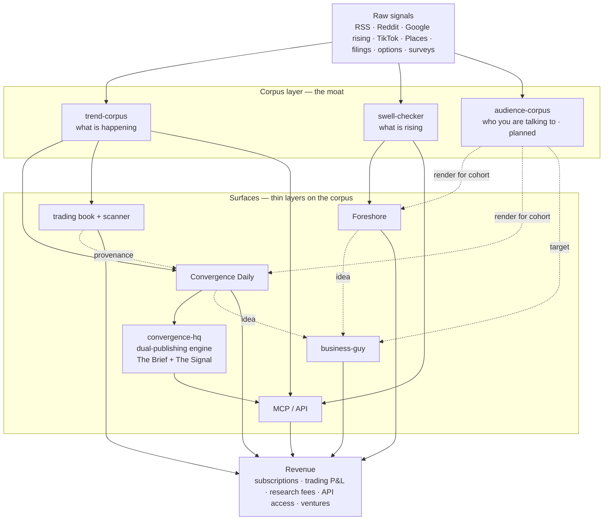

# Permanent Upper Class

Building the intelligence layer.

<!-- STATUS:START -->
**System status:** 🟡 attention needed · updated 2026-06-07 21:45 UTC
<!-- STATUS:END -->

---

The permanent underclass debates whether AI will take their jobs.  
The permanent upper class builds the AI.

---

## What we build

Sovereign systems for people who understand that **leverage compounds**.

Capital compounds. Knowledge compounds. Infrastructure compounds. The gap between those who build the tools and those who use them is not closing — it is widening, faster than most can perceive.

We build on the right side of that gap.

---

## The system at a glance

Four layers. Raw signals feed a **corpus layer** — the moat. Thin **surfaces** ride on the corpus. The surfaces generate **revenue**. The corpus is the product; the newsletters, bots, and APIs are only where it surfaces. Own the corpus, rent distribution until the audience exists.

The moat is never any single newsletter or bot — it is the corpus every surface rides on. Signals deepen the corpus, the corpus feeds the surfaces, the surfaces grow an audience and throw off ideas, and that funds wider signal coverage. Compounding, by construction.

---

## Trading + signal intelligence

**[trend-corpus](https://github.com/P-U-C/trend-corpus)** — the public sector-corpus  
14 themes. Sources → claims → entities → theses → decision packets → daily aggregates. Schema-validated. Public by construction.

**[puc-trading](https://github.com/P-U-C/puc-trading)** — LLM Convergence Options Scanner + Trade Journal  
The private trading runtime. Convergence merger, catalyst calendar, mispricing detector, two-bucket paper book (income + lottery), 7-phase transactional orchestrator. Paper-only until the 30-trade / 30-day gate clears.

**[trend-intel-private](https://github.com/P-U-C/trend-intel-private)** — semi-private bridge  
Sanitized claim text, entity-to-ticker exposure, opportunity rows. The layer between live private runtimes and the public scanner artifact contract.

---

## Consumer + editorial distribution

**[swell-checker](https://github.com/P-U-C/swell-checker)** — consumer / health trend discovery
Velocity + spread + vocabulary scoring across RSS, Reddit, Google rising, TikTok, and Places. Operator-gated proposals. The "what is rising" corpus.

**[editorial](https://github.com/P-U-C/editorial)** — the publishing layer *(private)*
Two products on top of the corpuses. **Foreshore** — health-sector trend intelligence, for operators who want the shape of a thing before their peers do. **Convergence Daily** — cross-sector market intelligence, synthesized from the sector corpuses and the scanner. Every issue ships twice: a human story and a machine-readable JSON artifact.

**[convergence-hq/convergence](https://github.com/convergence-hq/convergence)** — the dual-publishing engine
Read by humans, cited by machines. One canonical object compiles into two coordinated surfaces: **The Brief** (a fast human reading site) and **The Signal** (an immutable, content-addressed, cryptographically signed JSON object that agents can cite *and verify*). Convergence Daily is the first publication wired through it; the engine is forkable, so any publication can adopt the same dual-native contract.

**[business-guy](https://github.com/P-U-C/business-guy)** — opportunity research + outreach *(private)*
Takes the business and trade ideas the corpus surfaces and researches them — market size, incumbents, feasibility — turning a one-line read into a validated brief.

**audience-corpus** *(planned)* — the third corpus: who you are talking to
A living corpus of each demographic cohort's fears, hopes, drivers, and language, exposed as composable targeting infrastructure. Horizontal — it feeds both the editorial surfaces and business-guy.

---

## Post Fiat infrastructure

**[pft-validator](https://github.com/P-U-C/pft-validator)** — PFT validator dashboard + domain verification  
**[lens](https://github.com/P-U-C/pft-validator/tree/main/lens)** — the public validator lens: graph + audit + auth feeds  
**[herald](https://github.com/P-U-C/pft-validator/tree/main/herald)** — Post Fiat task / subs / forensics delivery  
**[pft-audit](https://github.com/P-U-C/pft-audit)** — task audit trails + reasoning chains (private)  
**[pf-monitor](https://github.com/P-U-C/pf-monitor)** — Prometheus + Grafana + Alertmanager for PF validators  
**[pf-scout-bot](https://github.com/P-U-C/pf-scout-bot)** — conversational scout bot for the Post Fiat Task Node  
**[pf-scout](https://github.com/P-U-C/pf-scout)** — composable contributor-recruitment database  
**[awesome-postfiat](https://github.com/P-U-C/awesome-postfiat)** — community reference

---

## b1e55ed -- sovereign trading intelligence

**[b1e55ed](https://github.com/P-U-C/b1e55ed)** — the system  
Event-sourced. Self-calibrating. Auditable by construction.

**[city](https://github.com/P-U-C/city)** — special economic zone, multi-agent architecture

---

## Agent payment + accountability primitives

**[rcpt](https://github.com/P-U-C/rcpt)** / **[pympp](https://github.com/P-U-C/pympp)** — the accountability primitive for the agent economy  
**[safetymd](https://github.com/P-U-C/safetymd)** — the trust standard for agent payments. Check before you pay.  
**[openclaw-skills](https://github.com/P-U-C/openclaw-skills)** — operator skills for b1e55ed + the PUC ecosystem  
**[agentify](https://github.com/P-U-C/agentify)** — bootstrap any repo to code like the Anthropic team  
**[review-council](https://github.com/P-U-C/review-council)** — generic multi-reviewer code review system

---

## Kindling — agent economy infrastructure

**[kind-ling.com](http://kind-ling.com/)** • **[github.com/kind-ling](https://github.com/kind-ling)**

**[flint](https://github.com/kind-ling/flint)** — agent social growth engine. Optimize for LLM inference decisions, not human engagement intuition.  
**[twig](https://github.com/kind-ling/twig)** — MCP tool description optimizer. Agents choose you or they don't. Twig makes them choose you.  
**[heat](https://github.com/kind-ling/heat)** — reputation-weighted agent and service routing oracle. x402-gated on Base.  
**[igniter](https://github.com/kind-ling/igniter)** — x402 + MCP + A2A scaffolding for any agent service  
**[docs](https://github.com/kind-ling/docs)** — agent economy infrastructure documentation

---

Compounding is quiet. That is how you know it is working.
